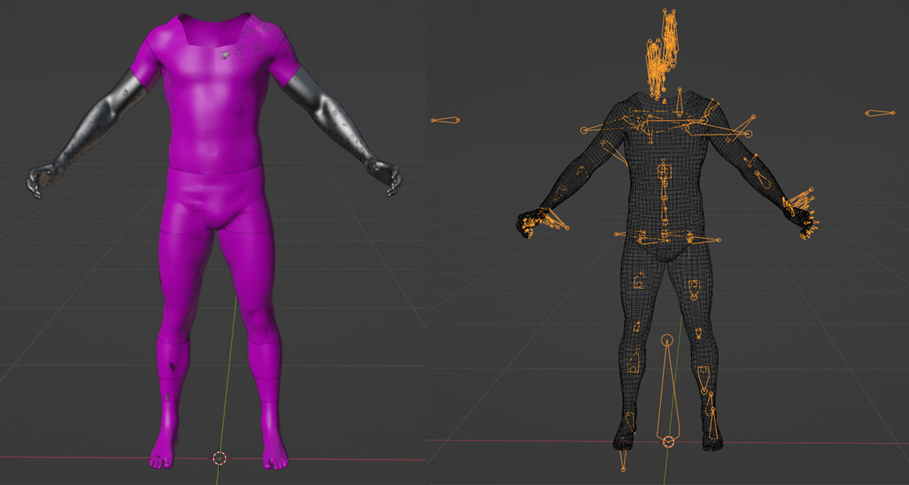
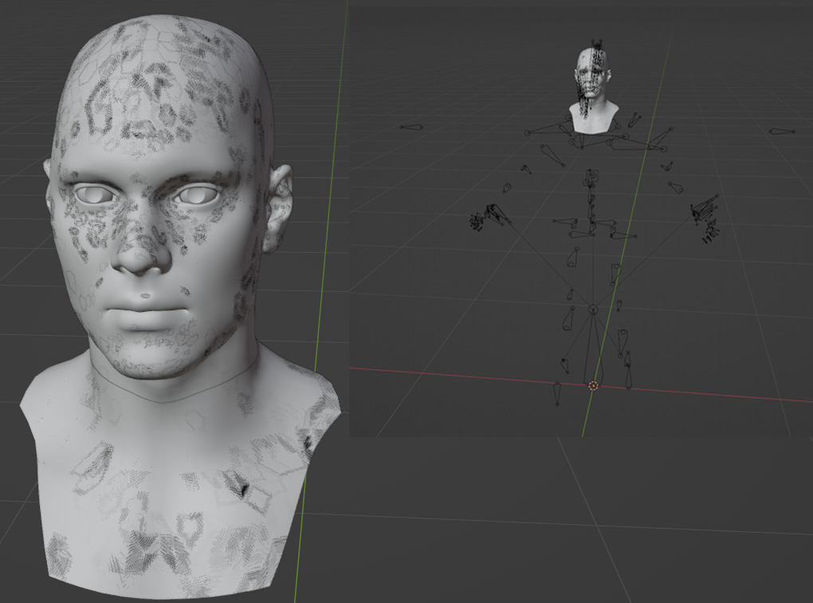
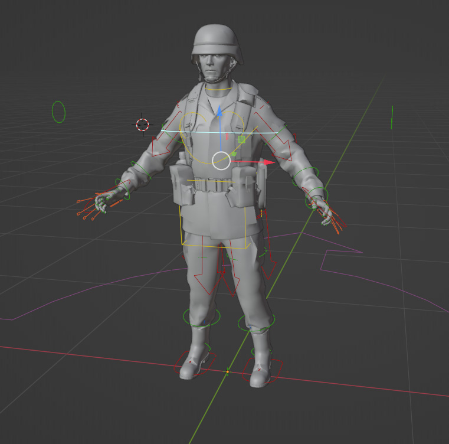

This folder contains files which are essential to create new gear or character animations.
# Content

## Character template
[Character_Template.fbx](https://github.com/BohemiaInteractive/Arma-Reforger-Samples/blob/main/SampleMod_NewCharacter/Assets/Characters/SampleCharacter/Character_Template.fbx "Character_Template.fbx")  contains mesh of the [Basebody_Male_01.xob](https://enfusionengine.com/api/redirect?to=enfusion://ResourceManager/~ArmaReforger:Assets/Characters/Basebody/Basebody_Male_01.xob) , which is in principle in-game base character mesh without any gear whatosover. This mesh is without the head, since factions are randomizing which head meshes are assigned.

[Character_Template.fbx](https://github.com/BohemiaInteractive/Arma-Reforger-Samples/blob/main/SampleMod_NewCharacter/Assets/Characters/SampleCharacter/Character_Template.fbx "Character_Template.fbx")  can be used to correctly adjust gear like **vests, pants, jackets or shoes** and for rough transfer of skinning.

>📝 Remember - any custom gear which is applied to character model has to use EXACTLY same skeleton as vanilla [Basebody_Male_01.xob](https://enfusionengine.com/api/redirect?to=enfusion://ResourceManager/~ArmaReforger:Assets/Characters/Basebody/Basebody_Male_01.xob)  - including empty objects/helpers! 

## Head template

[Head_Template.fbx](https://github.com/BohemiaInteractive/Arma-Reforger-Samples/blob/main/SampleMod_NewCharacter/Assets/Characters/SampleCharacter/Head_Template.fbx "Head_Template.fbx")  is a head model which, just like vanilla [Basebody_Male_Head_01.xob](https://enfusionengine.com/api/redirect?to=enfusion://ResourceManager/~ArmaReforger:Assets/Characters/Basebody/Basebody_Male_Head_01.xob), is separated from the rest of body. Both head and body share **same** skeleton.

[HeadSize_Template.fbx](https://github.com/BohemiaInteractive/Arma-Reforger-Samples/blob/main/SampleMod_NewCharacter/Assets/Characters/SampleCharacter/HeadSize_Template.fbx "HeadSize_Template.fbx") is a special model which is a mix of all available heads in game. This is model is quite useful for setting a head gear which you don't want to clip with any of the characters in game. 

## Animation Rig

[Character_AnimationRig_Example.blend](https://github.com/BohemiaInteractive/Arma-Reforger-Samples/blob/main/SampleMod_NewCharacter/Assets/Characters/SampleCharacter/Character_AnimationRig_Example.blend "Character_AnimationRig_Example.blend") is a special Blender file which contains Arma Reforger skeleton constrained to armature, which can be used in **Rigify**. 
>🚨**This model shouldn't be used for skinning!**

This blend files was used for instance in [Weapon Animation](https://community.bistudio.com/wiki/Arma_Reforger:Weapon_Animation "Arma Reforger:Weapon Animation") tutorial.