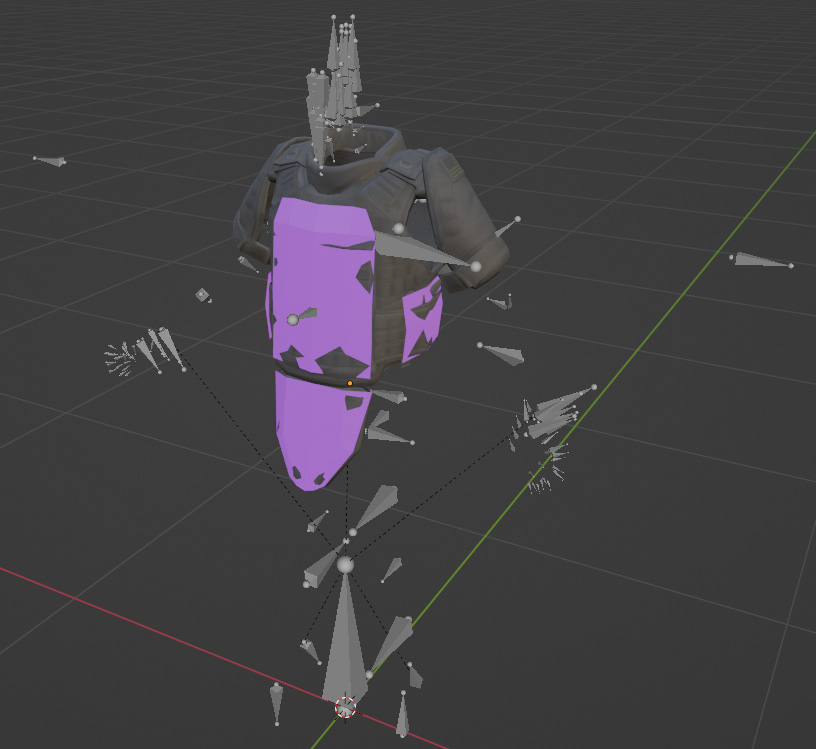

This folder contains example vest implemented in the game
# Content

## Sample Vest

Full documentation can be found on
https://community.bistudio.com/wiki/Arma_Reforger:Character_Gear_Creation/Vest

 
[VestSample.blend](https://github.com/BohemiaInteractive/Arma-Reforger-Samples/blob/main/SampleMod_NewCharacter/Assets/Characters/Vests/Vest_Sample/VestSample.blend "VestSample.blend")
VestSample.blend contains model of vest with Collections ready for export with Enfusion Blender Tools Batch FBX Export feature - https://community.bistudio.com/wiki/Arma_Reforger:Enfusion_Blender_Tools:_Batch_FBX_Export

Exported FBX models

 
[Vest_SampleVest_01.fbx](https://github.com/BohemiaInteractive/Arma-Reforger-Samples/blob/main/SampleMod_NewCharacter/Assets/Characters/Vests/Vest_Sample/Vest_SampleVest_01.fbx "Vest_SampleVest_01.fbx")

[Vest_SampleVest_01_item.fbx](https://github.com/BohemiaInteractive/Arma-Reforger-Samples/blob/main/SampleMod_NewCharacter/Assets/Characters/Vests/Vest_Sample/Vest_SampleVest_01_item.fbx "Vest_SampleVest_01_item.fbx")

[Vest_SampleVest_01_addon.fbx](https://github.com/BohemiaInteractive/Arma-Reforger-Samples/blob/main/SampleMod_NewCharacter/Assets/Characters/Vests/Vest_Sample/Vest_SampleVest_01_addon.fbx "Vest_SampleVest_01_addon.fbx")

[Vest_SampleVest_01_addon_item.fbx](https://github.com/BohemiaInteractive/Arma-Reforger-Samples/blob/main/SampleMod_NewCharacter/Assets/Characters/Vests/Vest_Sample/Vest_SampleVest_01_addon_item.fbx "Vest_SampleVest_01_addon_item.fbx")

